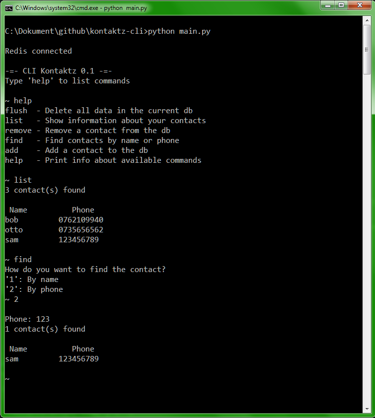

# kontaktz-cli
### A python CLI to manage contacts built with Redis.

---

### The return of the CLI:s

This started out as a school project (where I learned about how to use Python with the database Redis) but after thinking for a while I realised - Who doesn't want a CLI to manage their contacts!?

It's time to break the norms of using GUI-based applications, because (well-designed) CLI:s are so much smoother to work with. And thanks to their close to non-existing learning-curve compared to graphical applications, there's no point in waisting time anymore, go for a CLI today!

#### Screenshot of the UI

## Requirements:

* [Redis](http://www.redis.io)
* [redis.py](https://github.com/andymccurdy/redis-py)
* [prettytable.py](https://pypi.python.org/pypi/PrettyTable)
